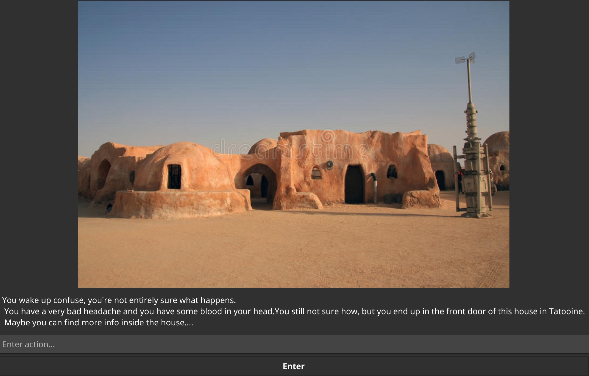
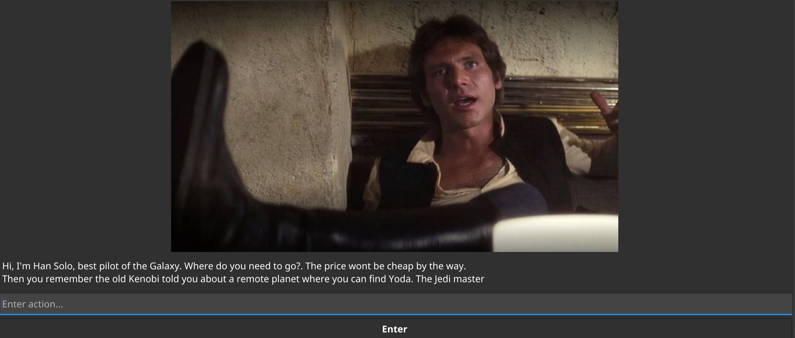
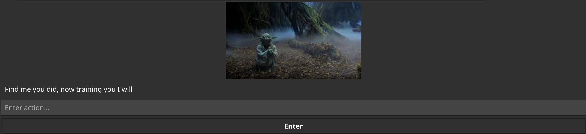

# 

A make your own adventure using golang, based on Star Wars characters.

For this game I used [fyne](https://github.com/fyne-io/fyne) library to build the GUI. 

# 


The game is working like the classic ```Make your own adventure```. You're in the middle of a situation, and you need to
escape, figuring the actions that you need to do in order to scape.

# 

Each level has a input text, where you need to type the ```actions``` you want to been able to move to the next level.

In each level, after a minute, you will receive a hint. And after two minutes it will be game over, and you will have to
start over again.

# 

The mean reason of this game, is to learn ```fyne``` library, and do some ```Golang``` Katas.


